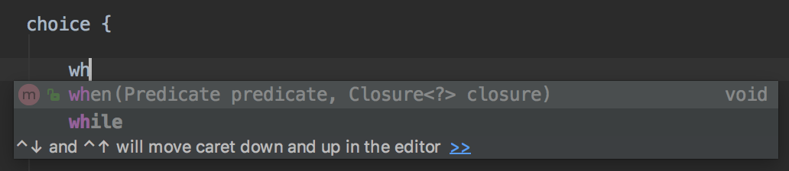
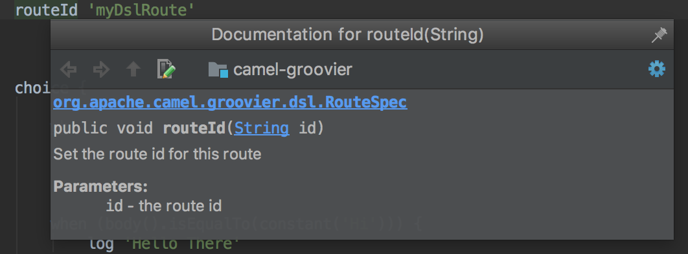

Groovier Camel DSL
===

This is a proof-of-concept for a more native Groovy DSL in [Apache Camel](camel.apache.org).

__Proof-of-concept means that it does not implement the entire Camel's EIP catalogue or contain sufficient unit testing.__

Proposal
---

Here is an example of the proposed DSL:

```groovy
@CompileStatic
class GroovierRoute extends RouteBuilder {
    @Override
    void configure() throws Exception {
    
        onException (Exception) {
            handled true
            to 'mock:error'
        }
    
        from ('direct:input') {
            routeId 'groovierRoute'
            
            onException (RuntimeException) {
                handled false
                log "Can't do much about this..."
            }
            
            choice {
                when (body().isEqualTo(constant('Hi'))) {
                    log 'Hello There'
                }
                otherwise {
                    process { throw new RuntimeException('Something has gone horribly wrong') } as Processor
                }
            }
            
            split (constant(1..4)) {
                log 'Split ${body}'
            }
            
            to 'mock:out'
        }
    }
}
```

`camel-groovier-example` provides a working example, based on what has been implemented so far. Run `gradle test` to execute it.

`@CompileStatic` additionally provides compile-time validation and type-checking of the route definition.

Decent IDEs provide code-completion, groovydocs, etc. without the need for a Groovy DSLD. For example, run `gradle idea` to import into Intellij IDEA.

Code completion:



GroovyDocs:



The old "closure support" from `camel-groovy` is also no longer required as closures can be coerced into `Processor`s, `Predicate`s, etc. using standard Groovy features.

Motivation
---

Apache Camel already offers a [Groovy DSL](http://camel.apache.org/groovy-dsl.html) but this is simply a thin facade over Camel Java DSL. Camel route definitions are inherently hierarchical, which is a poor fit for the builder pattern provided by Java DSL.


While Java developers are resigned to use this approach, Groovy is a much more expressive language with native support for creating DSLs. So rather than inheriting the limitations of the Java DSL, this proposal seeks to create a _Groovier DSL_.

This example demonstrates how a cleaner and more readable Camel DSL in Groovy is possible, without much compromise.

Further Ideas
---

* Given the fairly straight-forward adaptation of the current Java DSL API for this new DSL, a Java code generator can be used to generate `camel-groovier` by introspecting classes under `org.apache.camel.model`.